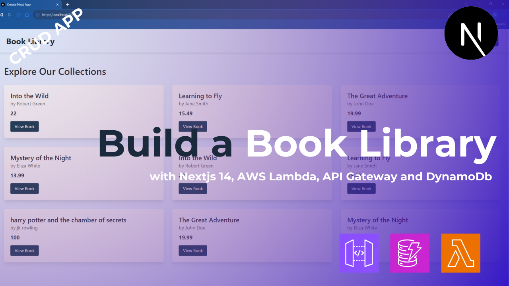

# How to Build a Book Library (CRUD App) with Nextjs 14, AWS Lambda, AWS Api Gateway and DynamoDb

A simple Book Library app built using **Next.js 14**, **Tailwind CSS**, **AWS DynamoDB**, **AWS Lambda** and **AWS API Gateway**. This app showcases CRUD (Create, Read, Update, Delete) operations for managing books, with server actions in Next.js and DynamoDB as the database.



Youtube: [Watch](https://www.youtube.com/watch?v=ygBVY_Veblk)

Article: [blog](https://thetechmaze.com/blog/how-to-build-a-book-library-with-nextjs-14-aws-lambda-aws-api-gateway-and-dynamodb)

## Prerequisites

- **Node.js** installed locally.
- An **AWS account** to use DynamoDB, Lambda and API Gateway.
- AWS API Gateway URL added to `.env.local`.

## Getting Started

1.  **Clone the repository:**

    ```bash
    git clone https://github.com/thetechmaze/book-library-next-dynamo.git
    ```

2.  **Install Dependencies**

    ```bash
    npm install
    ```

3.  **Set up Environment variables**

    Create a `.env.local` file in the root directory and add your AQWS credentials:

    ```bash
    AWS_API_URL=your-url
    ```

4.  **Run the development server**

    ```bash
    npm run dev
    ```

    Open http://localhost:3000 in your browser to see the app in action.

## Deployment

To Deploy this app, you can use platforms like Vercel or Netlify. Ensure you have your environment variables set correctly on the chosen platform.

## License

This project is open source and available under the [MIT Licence](./LICENCE).
